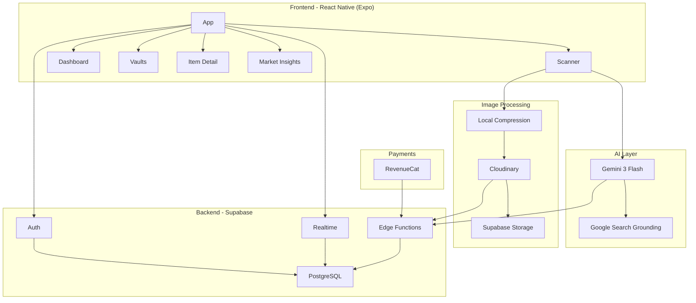

# 📜 Stamps & Coins - Geconsolideerd Blueprint

> **Versie:** 1.0  
> **Status:** MVP Planning  
> **Doel:** De "Bloomberg Terminal" voor de verzamelaar van munten en postzegels

---

## 1. 🎯 Product Visie & Kernwaarden

### Visie
Stamps & Coins is de **"Bloomberg Terminal" voor de verzamelaar** van munten en postzegels. De app elimineert handmatige data-entry door AI-gedreven herkenning en transformeert een statische verzameling in een **dynamisch, financieel portfolio**.

### Kernwaarden
- **Privacy-First**: Geen GPS-data, volledig anoniem tot de gebruiker kiest voor account
- **Speed-First**: Scan hele albums in seconden
- **Value-First**: Directe inzicht in de waarde van je collectie

---

## 2. 🏗️ Technologie Stack

| Component | Technologie | Functie |
|-----------|-------------|---------|
| **Frontend** | React Native (Expo) | Cross-platform mobile app (iOS/Android) |
| **Database & Auth** | Supabase (PostgreSQL) | Relationele data, user management, real-time sync |
| **Realtime Engine** | Supabase Realtime (Pub/Sub) | Live price updates tussen users zonder polling |
| **Logic Layer** | Supabase Edge Functions | IP-gebaseerde continent detectie, rate limiting, bulk updates |
| **AI Intelligence** | Gemini 3 Flash + Google Search Grounding | Object identificatie + real-time marktwaarde |
| **Image Processing** | Cloudinary | Automatisch croppen, compressie en hosting |
| **Payments** | RevenueCat | App Store/Play Store abonnementen beheer |

---

## 3. ✨ Core Features (MVP)

### A. AI-Powered "QuickScan"

**Technologie:** Gemini 3 Flash (via directe API key)

**Werking:**
1. Gebruiker richt camera op munt/zegel
2. AR-overlay voor randdetectie
3. Real-time feedback ("Houd stil...", "Meer licht...")
4. AI herkent:
   - **Identiteit:** Land, jaar, denominatie, variant
   - **Conditie (Visual Grading):** Schatting van staat
   - **Metadata Extractie:** Automatisch invullen van JSON-velden

**Bulk Scanning (2-20 items):**
- Volledige foto naar Gemini met prompt voor bounding box coördinaten
- Edge Function sliced foto via Cloudinary in losse afbeeldingen
- Skeleton screens met "Processing Dock" UI

**AI Response Format (Gestandaardiseerd JSON):**
```json
{
  "category": "Coin",
  "identity": { 
    "country": "NL", 
    "year": 1892, 
    "denomination": "10 Gulden" 
  },
  "condition": { 
    "grade": "VF", 
    "score": 7.5, 
    "notes": "Lichte slijtage op de rand" 
  },
  "market": { 
    "estimated_value": 450.00, 
    "currency": "EUR", 
    "confidence": 0.85 
  }
}
```

### B. Live Portfolio Tracking

- **Dynamische Waardering:** Via slimme caching-laag
- **Financiële Grafieken:** Totale waarde over tijd
- **Rarity Score:** AI-berekende zeldzaamheidsscore
- **24u verandering:** Percentage stijging/daling

### C. Smart Inventory & Cloud Sync

- **Offline-First:** Scannen zonder internet, sync bij verbinding
- **Multi-Vault Management:** Meerdere digitale "kluizen" (Belegging, Erfenis, Verkoop)

---

## 4. 📱 App Screens (User Journey)

### A. Dashboard (Het Hart)
**Doel:** Direct overzicht van financiële status

**Elementen:**
- Totaalwaarde (groot weergegeven)
- 24u verandering in percentage (+/- %)
- "Top Stijgers" widget
- Prominente FAB voor camera
- Horizontale nieuws-carrousel (Instagram Stories stijl)

**Data:** `portfolio_history`, `market_prices`

---

### B. The Scanner
**Doel:** Razendsnelle input

**Functionaliteit:**
- AR-overlay voor randdetectie
- Real-time feedback
- Live camera view met thumbnail van laatste scan
- Bulk-scan ondersteuning (tot 20 items)

---

### C. Item Detail (Diepe Duik)
**Doel:** Volledig inzicht in één object

**Informatie:**
- Hoge resolutie foto
- Historische prijsgrafiek
- Technische specs

**Voor Munten:**
| Veld | Beschrijving |
|------|--------------|
| Materiaal | Goud, Zilver, Koper (AI herkent glans/kleur) |
| Visual Grade | Sheldon Scale (1-70), focus op "high points" |
| Metadata | Land, jaartal, muntteken |

**Voor Postzegels:**
| Veld | Beschrijving |
|------|--------------|
| Perforatie | Kwaliteit tanding (compleet/afgeknipt) |
| Centrering | Positie afbeelding in papier |
| Conditie | MNH, VFU, OG |
| Metadata | Scott/Michel nummer, land, uitgiftedatum |

**Editable:**
- Vault wijzigen
- Aankoopdatum aanpassen
- Custom Value (Manual Override)

---

### D. The Vault (Overzicht)
**Doel:** Collectie beheer

**Functionaliteit:**
- Filter op Land, Periode, Waarde
- Groeperen in albums
- Zoekfunctie
- Filter-chips
- Grid/lijst weergave switch

---

### E. Market Insights (Educatie)
**Doel:** Marktinformatie

**Elementen:**
- AI-gecureerde nieuwsfeed (RSS aggregatie)
- Card-based design
- Generieke afbeeldingen als fallback
- Price Alerts als nieuws

---

### F. Profile Screen
**Elementen:**
- Pro status indicator
- Valuta instellingen (EUR/USD)
- Export knoppen
- Privacy Vault instellingen

---

## 5. 🔐 Onboarding & Authentication

### Ghost-to-Email Strategie
**Principe:** "First Value, Then Friction"

**Flow:**
1. **Ghost-fase:** Gebruiker kan direct scannen zonder account
2. **Trigger:** Bij opslaan of limiet bereiken
3. **Conversie:** E-mail registratie voor cloud sync

**Usecases:**
- **Snel-Scanner:** Direct waarde zien, daarna pas registreren
- **Bulk-Verzamelaar:** Portfolio opbouwen, dan pas account
- **Privacy-bewust:** Anoniem gebruiken tot Pro upgrade

### Onboarding Screens (Guided Discovery)

**Screen 1: Dashboard Preview**
- Mock portfolio met €12.450,80
- Coach mark: "Dit is je cockpit"

**Screen 2: Vaults Preview**
- Mock kluizen: "Zilveren Munten", "Zomerzegels"
- Coach mark: "Organiseer je bezit"

**Screen 3: Item Detail Preview**
- Mock item (Gouden Tientje)
- Coach mark: "Diepe duik in elk object"

**Screen 4: Market Preview**
- Coach mark: "Blijf op de hoogte"

**Screen 5: Call-to-Action**
- Pulserende FAB
- Pop-up: "Scan je eerste item"

**Screen 6: Privacy Vault**
- Visuele shredder animatie
- Coach mark: "Jouw privacy is prioriteit"

---

## 6. 💰 Monetization (0 naar 10k Strategie)

### Fase A: Free Tier (Acquisitie)
- **Limiet:** Max 35 items
- **Functies:** Basis identificatie en huidige waarde
- **Rate Limit:** 35 scans per uur

### Fase B: Pro Vault (€7,99/maand)
- **Unlimited Items**
- **Historische Data:** Prijsgrafieken tot 2 jaar
- **CSV/PDF Export:** 1x per jaar gratis, extra €19,99

### Implementatie: RevenueCat + Supabase
1. `react-native-purchases` SDK in app
2. Webhook naar Supabase Edge Function
3. Update `pro_status` in `profiles` tabel

---

## 7. 🗄️ Database Schema (Supabase PostgreSQL)

```sql
-- Gebruikersprofielen en Pro-status
CREATE TABLE profiles (
  id uuid REFERENCES auth.users ON DELETE CASCADE,
  pro_status boolean DEFAULT false,
  region text, -- 'EU', 'NA', 'ASIA'
  item_count integer DEFAULT 0,
  PRIMARY KEY (id)
);

-- Vaults (Kluizen voor organisatie)
CREATE TABLE vaults (
  id uuid DEFAULT uuid_generate_v4() PRIMARY KEY,
  user_id uuid REFERENCES profiles(id),
  name text,
  created_at timestamp with time zone DEFAULT now()
);

-- De verzameling
CREATE TABLE items (
  id uuid DEFAULT uuid_generate_v4() PRIMARY KEY,
  user_id uuid REFERENCES profiles(id),
  vault_id uuid REFERENCES vaults(id),
  name text,
  category text, -- 'coin', 'stamp'
  image_url text,
  metadata jsonb,
  purchase_price decimal,
  market_price decimal,
  manual_value decimal,
  ignore_price_suggestion boolean DEFAULT false,
  condition_report jsonb,
  material text,
  last_modified_at timestamp with time zone DEFAULT now(),
  created_at timestamp with time zone DEFAULT now()
);

-- Prijs caching per regio (Legacy)
CREATE TABLE price_cache (
  item_identifier text PRIMARY KEY,
  region text,
  last_value decimal,
  updated_at timestamp DEFAULT now()
);

-- Portfolio geschiedenis voor grafieken
CREATE TABLE portfolio_history (
  id uuid DEFAULT uuid_generate_v4() PRIMARY KEY,
  user_id uuid REFERENCES profiles(id),
  total_value decimal,
  date date DEFAULT CURRENT_DATE,
  UNIQUE(user_id, date)
);

-- Global Assets Registry
CREATE TABLE global_assets (
  id uuid DEFAULT uuid_generate_v4() PRIMARY KEY,
  asset_identifier text UNIQUE,
  name text,
  category text,
  metadata jsonb,
  created_at timestamp with time zone DEFAULT now()
);

-- Market Prices per continent
CREATE TABLE market_prices (
  id uuid DEFAULT uuid_generate_v4() PRIMARY KEY,
  asset_id uuid REFERENCES global_assets(id),
  region text, -- 'EU', 'NA', 'ASIA'
  current_value decimal,
  confidence_score decimal,
  updated_at timestamp DEFAULT now(),
  UNIQUE(asset_id, region)
);
```

---

## 8. ⚡ Edge Functions (Backend Logic)

### A. process-scan
Ontvangt Cloudinary URL, stuurt naar Gemini, parseert JSON, slaat item op.

### B. get-market-price
Google Search Grounding met 7-dagen cache logica.

**Continent-Logic Prompt:**
```
"Identificeer dit object. Zoek daarna de gemiddelde verkoopprijs van de 
afgelopen 3 maanden op de [Continent] markt. Geef de waarde terug in [Valuta]."
```

### C. handle-revenuecat-webhook
Update `pro_status` na bevestigde betaling.

### D. daily-batch-refresh
Cronjob voor nachtelijke prijsverversing (batches van 100 items).

### E. generate-news-feed
RSS scraping + AI samenvatting (elke 6 uur).

---

## 9. 🔄 Global Price Registry (Prijsmotor)

### Het "Liquid" Update Model

**Layer 1: Live Pro-Refresh (Milliseconden)**
- Check `market_prices`: prijs < 4 uur oud?
- Ja: Direct serveren uit cache
- Nee: Gemini Search Grounding → delen met alle users

**Layer 2: Freemium Daily Refresh**
- Max 1x per 24 uur
- Profiteert van Pro-user cache

**Layer 3: Massa-Update (Bulk)**
- Dagelijks 03:00 uur
- Top 1000 assets
- 100 items per API call

### Update Frequentie

| Type User | Refresh Snelheid | Data Freshness | Kosten |
|-----------|------------------|----------------|--------|
| Pro User | Instant (cache) of 3 sec (AI) | Max 4 uur | Laag |
| Free User | Instant (cache) | Max 24 uur | Verwaarloosbaar |
| Bulk Update | Dagelijks 03:00 | Top 1000 items | Minimaal |

### Confidence Score Validatie
- Score < 0.5: "Check vereist" vlaggetje
- 500% afwijking: automatische flagging

---

## 10. 🎨 Huisstijl (Brand DNA)

### Typografie
- **Koppen:** Modern Serif (autoriteit & geschiedenis)
- **Data/cijfers:** Clean Sans-Serif (leesbaarheid)

### UI/UX Componenten
| Element | Styling |
|---------|---------|
| Buttons | Glass-styled, linear-gradient, 1px border |
| Pop-ups | Gecentreerd, zware achtergrond-blur |
| Widgets | Afgeronde hoeken (20pt), zachte schaduw |
| Toasts | Semi-transparant, bovenaan scherm |
| Sections | Witruimte (Spatial UI) |

### Vormgeving
- **Glassmorphism:** Transparante lagen voor UI-kaarten
- **Skeuomorfe accenten:** Metaalglans/papierstructuur in iconen
- **Layout:** Ruim, focus op object-pracht

---

## 11. 🛡️ Privacy & Security

### GPS Stripping Pipeline
1. **Local Scrubbing:** `react-native-exif` verwijdert EXIF-data
2. **Server-side Check:** Edge Function blokkeert bij GPS-detectie

### Image Optimization
- Client-side compressie naar max 1080px
- Cloudinary transformatie
- Supabase Storage voor permanente opslag

---

## 12. 🚨 Error Handling & Sentry Logging

### User-Facing Errors

| Scenario | Toast/UI Melding |
|----------|------------------|
| Slechte belichting | "Foto onduidelijk. Zorg voor goed licht." |
| Geen internet | "Offline. Scan lokaal opgeslagen." |
| AI herkent niets | "Item niet herkend. Voer handmatig in." |
| Limiet bereikt | "Kluis vol! Upgrade naar Pro." |
| Prijs niet gevonden | "Geen prijsdata. Voeg zelf waarde toe." |

### Sentry Error Categories

**A. AI & Grounding**
- `ERROR: Gemini_Parse_Failure`
- `FATAL: Gemini_API_Timeout`
- `WARN: Grounding_No_Result`
- `ERROR: Grounding_Low_Confidence`

**B. Storage & Privacy**
- `CRITICAL: EXIF_Scrubbing_Failed`
- `ERROR: Cloudinary_Upload_Error`
- `ERROR: Supabase_Storage_Full`

**C. Auth & Subscription**
- `ERROR: RevenueCat_Purchase_Error`
- `ERROR: Webhook_Sync_Mismatch`
- `WARN: Anon_Auth_Conversion_Failed`

**D. Data & Database**
- `ERROR: Edge_Function_Crash`
- `ERROR: Database_Postgrest_Violation`
- `WARN: Rate_Limit_Triggered_User`

### Sentry Tags
- `environment`: staging / production
- `os`: iOS / Android
- `user_tier`: free / pro
- `action`: manual_scan / bulk_scan / price_refresh
- `item_category`: coin / stamp / unknown

---

## 13. ✅ Testing Strategy

### A. Unit Tests (Jest)
- [ ] Manual Value Persistence
- [ ] Suggestion Suppression (`ignore_price_suggestion`)
- [ ] Exif-Scrubber functionaliteit
- [ ] 35-Item Counter (bulk-scan telt mee)
- [ ] Currency Conversion
- [ ] 36ste Item blokkering

### B. Integratie Tests
- [ ] Gemini-to-Supabase JSON parsing
- [ ] Cloudinary-to-Storage flow
- [ ] RevenueCat-Sync (< 2 seconden)
- [ ] Ghost-to-Email data behoud

### C. Edge Function Tests
- [ ] Privacy-Failsafe (GPS blocking)
- [ ] Batch Refresh Quota
- [ ] AI Hallucination Check (onmogelijke data)
- [ ] Bounding Box Overlap detectie

### D. E2E Tests
- [ ] Happy Path Scan flow
- [ ] Paywall Blocking
- [ ] Onboarding regression

### E. Test Data Fixtures
Centralized mock data located in `src/__tests__/fixtures/`:

```typescript
// Usage in any test file
import { mockStampMint, mockProUser, mockVaultStamps } from '../fixtures';

(itemService.getItem as jest.Mock).mockResolvedValue(mockStampMint);
```

| File | Contents |
|------|----------|
| `users.ts` | `mockFreeUser`, `mockProUser`, `mockNewUser`, `mockSession` |
| `vaults.ts` | `mockVaultStamps`, `mockVaultCoins`, `mockUserVaults` |
| `items.ts` | `mockStampMint`, `mockCoinGold`, `mockStampCollection` |
| `index.ts` | Barrel export for all fixtures |

### Definition of Done (DoD)
- [ ] **Unit Tests**: Backend services en kritieke flows hebben 100% coverage.
- [ ] **Component Tests**: Nieuwe UI-componenten zijn gedekt met RNTL tests.
- [ ] **Automated Verification**: `npm test` slaagt zonder failures (0 errors).
- [ ] **Error Handling**: Edge cases zijn afgevangen en Sentry logging is toegevoegd.
- [ ] **Privacy Check**: Bevestigd dat geen gevoelige data (EXIF/GPS) wordt opgeslagen.
- [ ] **Documentation**: `DEVELOPMENT_TASKS.md`, `task.md` en `walkthrough.md` zijn bijgewerkt.
- [ ] **Source Control**: Wijzigingen zijn gecommit en gepushed naar de remote repository.

---

## 14. 🔧 CI/CD Pipeline (GitHub Actions)

### Branching Strategy
- `feature/*` - Nieuwe functies
- `develop` - Integratie (EAS Preview)
- `main` - Productie (EAS Production)

### Pipeline Stappen
1. **Lint & Typecheck** - Syntaxfouten voorkomen
2. **Jest Suite** - Unit & Integratie tests
3. **Security Audit** - Kwetsbaarheden scan
4. **Build** - Alleen bij geslaagde tests

---

## 15. ⚠️ Kritieke Zwaktes (Pre-Launch Checklist)

### A. Gemini Hallucinatie Val
**Probleem:** AI kan verkeerd jaartal roepen met overtuiging
**Oplossing:** Confidence Score UI - veld geel bij < 80%

### B. Database Concurrency
**Probleem:** Cronjob overschrijft handmatige wijziging
**Oplossing:** `last_modified_at` timestamp check

### C. Cloudinary Kosten
**Probleem:** 20 items per scan kan snel oplopen
**Oplossing:** Client-side compressie (1080p) voor upload

---

## 16. 📋 Backlog (Toekomstige Features)

| Feature | Beschrijving |
|---------|--------------|
| **Verzekeringsrapporten** | PDF-export met foto's en dagwaarde |
| **Privacy Incognito Mode** | FaceID beveiligde toegang |
| **AI-Nalatenschap Planner** | Overzicht voor nabestaanden |
| **Echtheid-Check (Beta)** | AI detectie van vervalsingen |
| **Arbitrage Logica** | Prijsvergelijking tussen continenten |
| **Affiliate Shops** | Links naar koop/verkoop platformen |
| **Share Cards** | Social media afbeeldingen |
| **Achievements** | Badges voor verzamelaars |

---

## 17. 📊 Samenvatting Architectuur



---

> **Laatste update:** 31 december 2024  
> **Document eigenaar:** Development Team  
> **Status:** Ready for Implementation Planning
